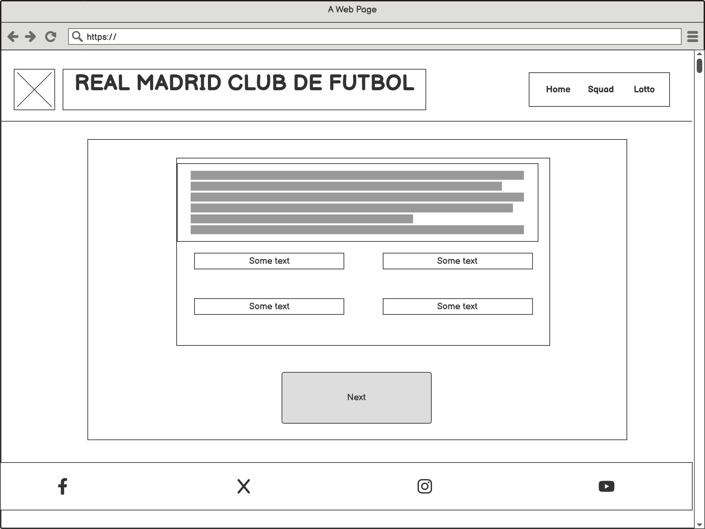
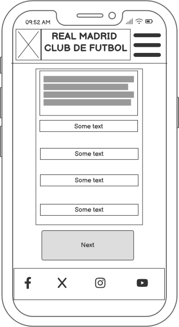
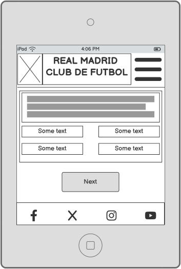
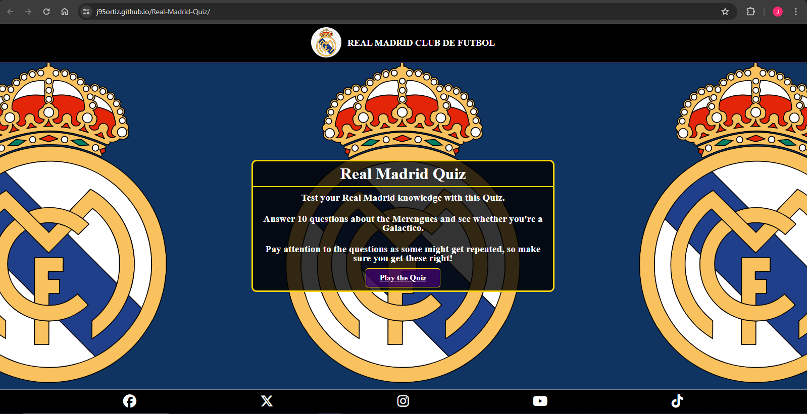
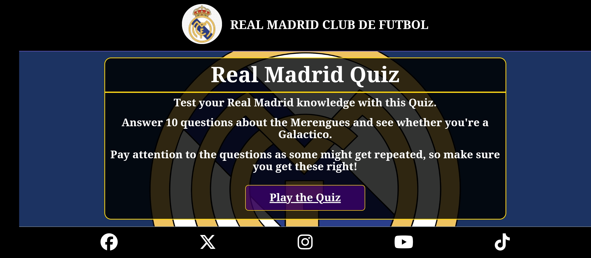
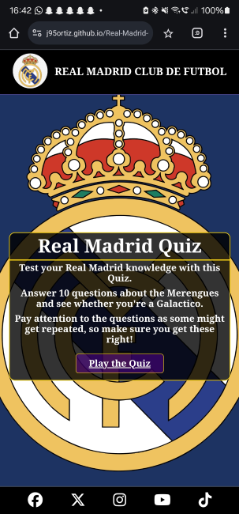
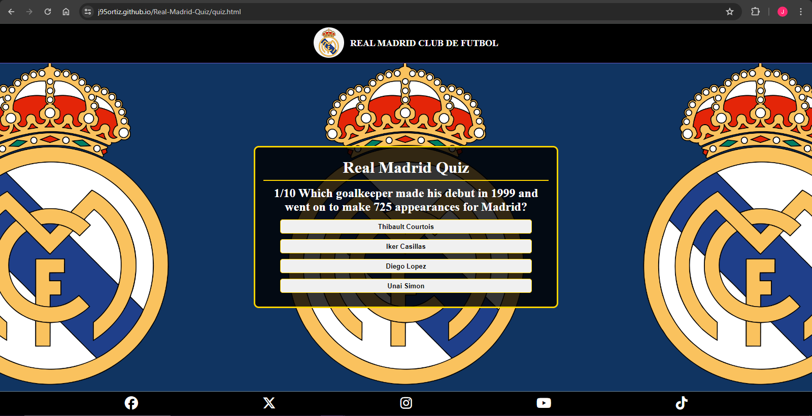

# **REAL MADRID QUIZ**

# INTRODUCTION

[Real Madrid Quiz](https://j95ortiz.github.io/Real-Madrid-Quiz/)

# USER EXPERIENCE

## OVERVIEW

## WIREFRAMES

The wireframes were created on Balsmiq and were used to represent the structure and layout intended on the site

Although the final design varies slightly from the initial wireframes, these can be seen below:

## SITE STRUCTURE

The site is split into 2 main pages:

1. [The Main Instructions Page](index.html)

2. [The Quiz Page](quiz.html)

## DESIGN CHOICES

# FEATURES

## OUTLINE

## MAIN FEATURES

### NAVIGATION BAR

### FOOTER

### INDEX PAGE

 
 

### QUIZ PAGE

 

### RESULTS SCREEN

## FUTURE FEATURES

# TESTING

## PERFORMANCE & ACCESSIBILITY

The questions used in the quiz, and the file with the quiz setup and structure are stored in separate JS files:

1. [Quiz Questions and Answers File](assets/js/questions.js)

2. [Quiz Creator and Logic File](assets/js/script.js)

This way in future whenever anyone wants to add a question, update the answers or remove a question this is now easier to do.

## VALIDATOR TESTING

Index Page:

Quiz Page:

CSS:

Javascript:

# TROUBLESHOOTING

# DEPLOYMENT

# CREDIT

## MEDIA CREDITS

## CONTENT CREDIT

## ACKNOWLEDGEMENTS
