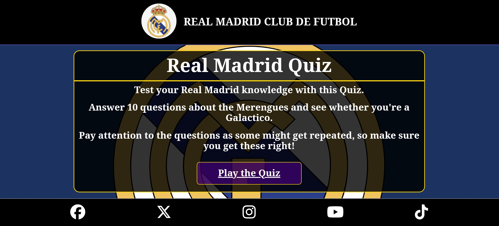
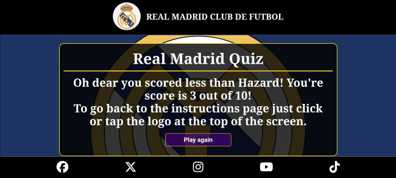
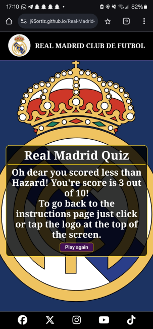
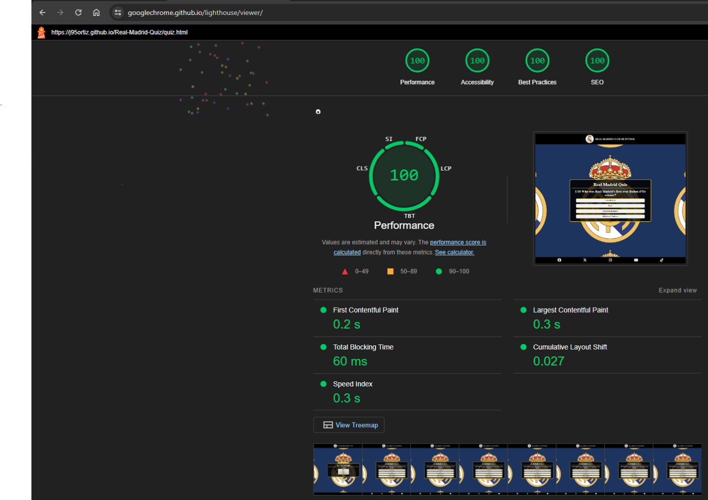

# **REAL MADRID QUIZ**

# INTRODUCTION

This site was created with the idea of being an extension to my first portfolio website which you can find linked below:

[Real Madrid Page](https://j95ortiz.github.io/Real-Madrid-Portfolio-project-1/index.html)

[Real Madrid Github Repository](https://github.com/J95Ortiz/Real-Madrid-Portfolio-project-1)

Feel free to have a go and test your Real Madrid Trivia knowledge by following the link to the webpage - [Real Madrid Quiz](https://j95ortiz.github.io/Real-Madrid-Quiz/)

# USER EXPERIENCE

## OVERVIEW

The user's experience was put at the forefront of the design of this page, however there are a couple of features which I want to add in future

#################################

**in order to improve it / so as to make it better.**

##################################

## WIREFRAMES

The wireframes were created on Balsmiq and were used to represent the structure and layout intended on the site

Although the final design varies slightly from the initial wireframes, these can be seen below:

## SITE STRUCTURE

The site is split into 2 main pages:

1. [The Main Instructions Page](index.html)

2. [The Quiz Page](quiz.html)

## DESIGN CHOICES

# FEATURES

## OUTLINE

## MAIN FEATURES

### NAVIGATION BAR

### FOOTER

### INDEX PAGE

### QUIZ PAGE

The quiz page is set up really simply and only contains the question with a counter out of ten, and the options for the user to choose from.

The four answer options are responsive to the user hovering their mouse over them.

Once a question has been answered, the selected answer will change colour depending on the user's choice.

If the user answers correctly then their selection will be highlighted green, and if their choice is incorrect then their choice will be highlighted in red, and the correct answer's box will go green.

The "Next" button is also responsive and its colours are inverted when th user hovers their mouse or taps it. However, it is only displayed once the question on the screen has been answered, with the aim being to improve the users' experience while playing. I created it this way following a comment from one of my friends who I showed the initial design to.

They suggested that if the button was visible to the user, they might try and skip a question if they didn't know the answer which would probably affect their experience.

To prevent a user skipping the question altogether and prompt them to at least have a guess, the "Next" button is only visible and actionable once the question has been answered. This way the user might get the answer right even if they didn't know what it was, giving them a better experience on the platform.

### RESULTS SCREEN

The Results screen design is meant to be consistent with the rest of the site, maintaining the same colour combinations as the instructions page and the question screens. 

The play again button is styled the same way as the "Next" button, and is responsive in the same way.

 

I thought that a good way of improving the user's experience would be to add a message which changes depending on their score. I therefore created 3 different messages, and the user should see the apropriate one depending on what their score is.

If they score higher than 7 the message will look like this:

If they score between 5 and 7, the message displayed will look like this:

 

And if they score less than 5, the message displayed will look something like this:

 

The line indicating to the user how to get back to the instructions page was added after another comment from a user I asked to try out the site and said they believed it would improve the experience and provide further clarity.

## FUTURE FEATURES

# TESTING

## PERFORMANCE & ACCESSIBILITY

The questions used in the quiz, and the file with the quiz setup and structure are stored in separate JS files:

1. [Quiz Questions and Answers File](assets/js/questions.js)

2. [Quiz Creator and Logic File](assets/js/script.js)

This way in future whenever anyone wants to add a question, update the answers or remove a question this is now easier to do.

## VALIDATOR TESTING

The W3C [Markup Validation Service](https://validator.w3.org/#validate_by_input) was used to check the HTML code on both pages, and they passed.

Index Page:

Quiz Page:

CSS:

Javascript:

# TROUBLESHOOTING

# DEPLOYMENT

# CREDIT

## MEDIA CREDITS

## CONTENT CREDIT

## ACKNOWLEDGEMENTS
