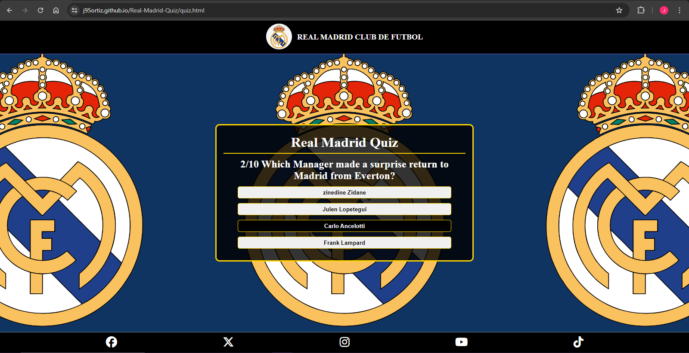
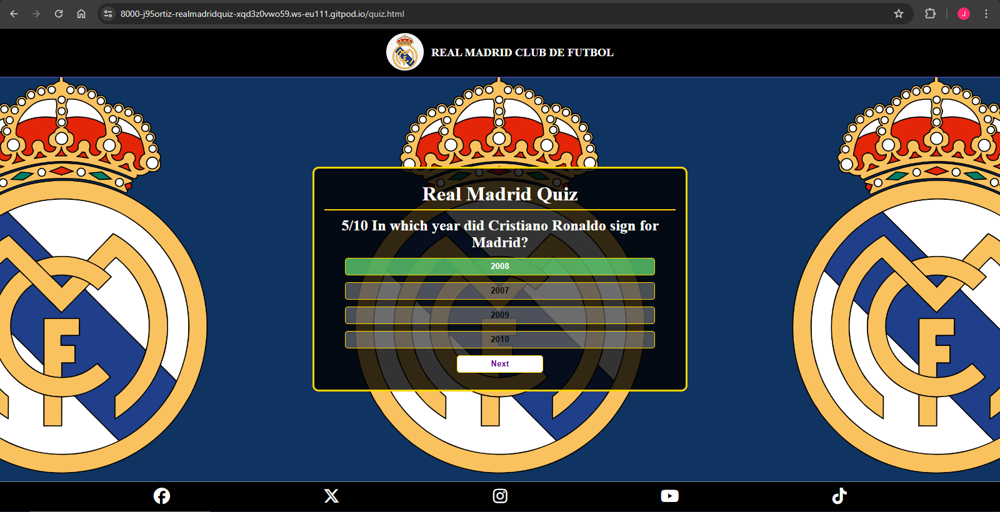

# **REAL MADRID QUIZ**

# CONTENTS

- [INTRODUCTION](#introduction)

- [CONTENTS](#contents)

- [USER EXPERIENCE](#user-experience)

  - [Overview](#overview)
  - [Wireframes](#wireframes)
  - [Site Structure](#site-structure)
  - [Design Choices](#design-choices)

- [FEATURES](#features)

  - [Outline](#outline)
  - [Main Features](#main-features)
    - [Navigation Bar](#navigation-bar)
    - [Footer](#footer)
    - [Index Page](#index-page)
    - [Quiz Page](#quiz-page)
    - [Results Screen](#results-screen)
  - [Future Features](#future-features)

- [TESTING](#testing)

  - [Performance & Accessibility](#performance--accessibility)
  - [Validator Testing](#validator-testing)

- [TROUBLESHOOTING](#testing)

- [DEPLOYMENT](#deployment)

- [CREDIT](#credit)
  - [Content Credits](#content-credit)
  - [Media Credts](#media-credits)
  - [Acknowledgements](#acknowledgements)

# INTRODUCTION

This project was designed to be used as a quiz game which the user can play. It's built and set up so the User Feels they can test their Real Madrid knowledge.

I created the quiz around the current Real Madrid Senior Team and its history because my intention is for it to be an extension to my first portfolio website which you can find linked below:

- [**_Real Madrid Page_**](https://j95ortiz.github.io/Real-Madrid-Portfolio-project-1/index.html)

- [**_Real Madrid Github Repository_**](https://github.com/J95Ortiz/Real-Madrid-Portfolio-project-1)

Originally I'd wanted the Real Madrid Site I built to have a game side to it, so that the users felt there was a fun side to the Site rather than it just being informative. However at the time I wasn't able to create this as my knowledge of Javascript was incredibly limited.

The Quiz Site is now fully operational so feel free to have a go and test your Real Madrid Trivia knowledge by following the link below:

- [**_Real Madrid Quiz_**](https://j95ortiz.github.io/Real-Madrid-Quiz/)

# USER EXPERIENCE

## OVERVIEW

The user's experience was put at the forefront of the design of this page, however there are a couple of features which I want to add in future and I've referred to these in the [Future Features Section](#future-features). Once the Quiz Site is linked to the main Real Madrid Site and these future features implemented, I believe the User's Experience will be even better.

## WIREFRAMES

The wireframes were created on [Balsmiq](https://balsamiq.com/wireframes/) and were used to represent the structure and layout intended on the site

Although the final design varies slightly from the initial wireframes, these can be seen below:

## SITE STRUCTURE

The site is split into 2 main pages:

1. [__The Main Instructions Page__](index.html)

2. [__The Quiz Page__](quiz.html)

The Results Screen will be displayed to the User once they've completed the quiz, and is part of the [quiz.html](quiz.html) file. The code in [script.js](script.js) checks whether all the questions have been answered using the *displayNext()* & *resetState()* functions. Once this is done, by combining these functions with the *gameScore()* function the question is replaced with the User's score and a message is displayed alongside it which changes depending on how many questions they got right.

The questions used in the quiz, and the file containing the quiz structure and logic are stored in separate JS files:

1. [__Quiz Questions and Answers File__](assets/js/questions.js)

2. [__Quiz Creator and Logic File__](assets/js/script.js)

This way in future whenever anyone wants to add a question, update the answers or remove a question this is easier to do.

## DESIGN CHOICES

This Real Madrid Quiz Site was designed to feel like an extension of the Real Madrid Page built for my first Portfolio Project.

On that page I took inspiration from some of my favourite kits and mainly used a Navy, Black and Gold colour theme, so I've tried to keep this colour scheme consistent for the Quiz Site.

Some of the Feedback following the submission of the first project was that the site sometimes felt too cluttered with too much going on, and it may have been harder for a User to focus on something specific and could even make them feel overwhelmed. As such, in order to mitigate this the main change I did was to make the background image larger. This way it doesn't feel like there's so much going on in the background and makes the site feel cleaner. I will also apply this change to the Madrid Site so as to make all pages of the site feel consistent.

# FEATURES

## OUTLINE

Even though the site has only two main pages, the main intention is that from a User's perspective it wil feel like it's split into three parts:

1. [*Instructions*](#index-page)

2. [*Quiz Questions*](#quiz-page)

3. [*Result Screen with score, message and "Play Again" button*](#results-screen)

## MAIN FEATURES

### NAVIGATION BAR

When this site is linked to the Real Madrid Project, the aim is that the User will also see links in the Navigation Bar which they can then use to navigate the full site.

### FOOTER

The User will find links to Real Madrid's Official Social Media Channels on the footer, and these are displayed with icons so the user knows which Social Media site they're accessing. 

These open in a new tab when actioned, so as to give the User more autonomy and control over how they choose to navigate the site.

### INDEX PAGE

This is the first screen the User will see when they access the quiz link. It's simply laid out and has been styled so that it looks good across all screen sizes, and also changes depending whether the device the User is using is in landscape or portrait mode.

### QUIZ PAGE

The quiz page is set up really simply and only contains the question with a counter out of ten, and the options for the user to choose from.

The four answer options are responsive to the user hovering their mouse over them.

Once a question has been answered, the selected answer will change colour depending on the user's choice.

If the user answers correctly then their selection will be highlighted green, and if their choice is incorrect then their choice will be highlighted in red, and the correct answer's box will go green.

The "Next" button is also responsive and its colours are inverted when the user hovers their mouse or taps it. However, it is only displayed once the question on the screen has been answered, with the aim being to improve the users' experience while playing. I created it this way following a comment from one of my friends who I showed the initial design to.

They suggested that if the button was visible to the user, they might try and skip a question if they didn't know the answer which would probably affect their experience.

To prevent a user skipping the question altogether and prompt them to at least have a guess, the "Next" button is only visible and actionable once the question has been answered. This way the user might get the answer right even if they didn't know what it was, giving them a better experience on the platform.

### RESULTS SCREEN

The Results screen design is meant to be consistent with the rest of the site, maintaining the same colour combinations as the instructions page and the question screens.

The play again button is styled the same way as the "Next" button, and is responsive in the same way.

I thought that a good way of improving the user's experience would be to add a message which changes depending on their score. I therefore created 3 different messages, and the user should see the apropriate one depending on what their score is.

If they score higher than 7 the message will look like this:

If they score between 5 and 7, the message displayed will look like this:

And if they score less than 5, the message displayed will look something like this:

The line indicating to the user how to get back to the instructions page was added after a comment from my Mentor Precious Ijege, who said they believed it would improve the experience and provide further clarity.

This was supported by other users who I'd got to try out the site before the instructions page had been added, and they agreed that it made the whole site feel clearer, more professional and streamlined.

## FUTURE FEATURES

The main Feature I'd like to add to the Quiz site is add links to the header

Make the Play Game button responsive also

Add a link to Madrid Project Home Page next to Play again

# TESTING

## PERFORMANCE & ACCESSIBILITY

Performance testing was carried out on both pages using the [Lighthouse feature on Google Chrome's Dev Tools](https://googlechrome.github.io/lighthouse/viewer/).

_Instructions Page Results:_

_Quiz Page Results:_

## VALIDATOR TESTING

The W3C [Markup Validation Service](https://validator.w3.org/#validate_by_input) was used to check the HTML code on both pages, and they passed.

_Index.html:_

_Quiz.html:_

The [W3C CSS Validation Service](https://jigsaw.w3.org/css-validator/) was used to check the CSS code and it also passed.

_Style.css:_

The [JSHint Javascript Validation Service](https://jshint.com/) was used to check the Javascript files and they passed.

_Script.js:_

# TROUBLESHOOTING

My first issue came about when trying to create a formula which would pick 10 random numbers between 1 & 50, and using them to create an array to be used in the quiz.

I struggled getting the page to reload the quiz with different questions

# DEPLOYMENT

# CREDIT

## CONTENT CREDIT

Quiz Logic and Inspiration Credit:

[Javascript Youtube Tutorial](https://simplestepscode.com/javascript-quiz-tutorial/)

[How To Make Quiz App Using JavaScript | Build Quiz App With HTML CSS & JavaScript](https://www.youtube.com/watch?v=PBcqGxrr9g8)

[Build A Quiz App With JavaScript](https://www.youtube.com/watch?v=riDzcEQbX6k)

Quiz Question Content Credit Links:

- http://www.freepubquiz.co.uk/real-madrid.html

- [Real Madrid Trivia Template | LivePolls | QuestionPro](https://www.questionpro.com/livepolls/templates/real-madrid-trivia-questions/)

- https://en.wikipedia.org/wiki/Sergio_Ramos

- https://www.realmadrid.com/en-US/the-club/history/football-legends/cristiano-ronaldo-dos-santos-aveiro

- https://bleacherreport.com/articles/10061039-gareth-bale-retires-at-33-won-champions-league-5-times-with-real-madrid#:~:text=The%2033%2Dyear%2Dold%20is,in%20a%20nine%2Dyear%20stretch.&text=He%20also%20played%20for%20Tottenham,FC%20at%20the%20club%20level

- https://www.realmadrid.com/en-US/the-club/history/football-legends/sergio-ramos-garcia

- https://www.transfermarkt.co.uk/zinedine-zidane/alletore/spieler/3111/plus/0?saison=&verein=418&liga=&wettbewerb=&pos=&minute=&pos=&torart=&stand=

- https://www.transfermarkt.co.uk/sergio-ramos/alletore/spieler/25557/plus/0?saison=&verein=418&liga=&wettbewerb=&pos=&minute=&pos=&torart=&stand=

- https://www.marca.com/en/football/real-madrid/2021/06/17/60ca692722601d4f438b4696.html

- https://www.planetsport.com/soccer/iker-casillas

- https://www.transfermarkt.co.uk/iker-casillas/leistungsdatenverein/spieler/3979

- https://www.transfermarkt.co.uk/eden-hazard/leistungsdatenverein/spieler/50202

- https://www.transfermarkt.co.uk/raul/erfolge/spieler/7349

- https://www.transfermarkt.co.uk/gareth-bale/leistungsdatenverein/spieler/39381

## MEDIA CREDITS

- The favicon images were created using the [Favicon Generator](https://realfavicongenerator.net/).

- The imagesz for the links in the footer were obtained from the [Font Awesome Website](https://fontawesome.com/search?o=r&m=free).

- The colour Palette image was created using [Colors.co](https://coolors.co/).

## ACKNOWLEDGEMENTS

I would like to mention my mentor Precious Ijege for his support and input during the building process. His input and comments on how to improve the site helped me streamline the process, and his suggestion to add an instructions page was a great idea which I'm now glad I've implemented as it gives the site a better feel from a User's persopective.

A further thank you to the Student Support Team at Code Institute for their assistance so far on the course.
